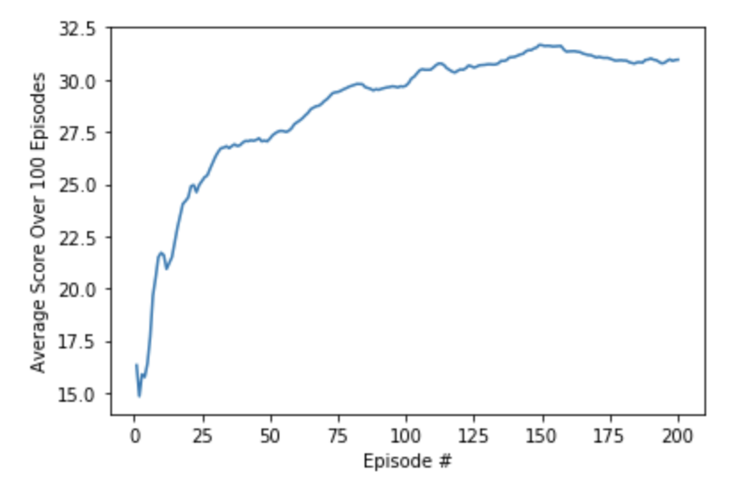

# Description of the Implementation

Install the dependencies as mentioned in README section.
Run 'Continuous_Control_Solution_Multiple Agents.ipynb' file to train the agent.

# Learning Algorithm

DDPG (Deep deterministic Policy gradient) method is used to train the agent.

Many tasks of interest, most notably physical control tasks, have continuous (real valued) and high dimensional action spaces.
Adapting deep reinforcement learning methods such as DQN to continuous domains is to to simply discretize the action space. However, this has many limitations, most notably the curse of dimensionality: the number of actions increases exponentially with the number of degrees of freedom.

DDPG is a model-free, off-policy actor-critic algorithm using deep function approximators that can learn policies in high-dimensional, continuous action spaces.

Actor- Critic agent is an agent that uses function approximation to learn a policy and a value function. Two neural networks are used, one for actor and one for critic.
Actor network takes state as input and actions as output. Critic network takes states as input and output a state value function of policy pi.
Use of 'soft target' updates, means that the target values are constrained to change slowly, greatly improving the stability of learning.

Basic algorithm is a follows: Critic and actor network are initialized with random weights. Agent interacts with an environment, in a sequence of actions, observations and rewards. 
At each time-step the agent selects an action from the set of allowed game actions according to current policy and exploration noise. .
Agent receives a reward representing the change in game score.
Sequences of actions and observations are stored in the buffer. Once buffer reaches the set limit random minibnatch of N transitions are chosen.
Critic network is updated by minimizing the loss function and actor policy is updated using gradient. Finally, target networks (actor and critic) are 'soft' updated.

Details of the algorithm and implementation can be found in this link.

## Hyperparameters used in this implementation ##
GAMMA = 0.99, TAU = 1e-3, Learning rate of Actor = 1e-4, Learning rate of Critic = 1e-3, WEIGHT_DECAY = 0 
For exploration noise for Ornstein-Uhlenbeck process, throughout training theta and sigma are modified ranging from 0.1 to 0.9.

## Neural Network Architecture ##
There are two neural networks, one for actor and one for critic. Each Neural network consists of an input layer of dimention (24,1). Which is the size of the state. Two hidden layers with 400 and 300 nodese and then an output layer with 2 nodes, representing 2 action space. 'Tanh' activation function is used for actor network and 'RELU' activation function is used for critic netwrok.

# Plot of Rewards

Number of episodes required was roughly 240. At the start of the training, Learning rate and noise parameters was high. However, large fluctuations were observed in the rewards. Used this initial weight to continue training with lower learning rates and noise parameter.

Break Down of the noise paramerts for various iterations:

Iteration 1: mu=0., theta=0.9, sigma=0.9, max_t = 300, number of episodes to achieve an average of 6.71 = 86

Iteration 2: mu=0., theta=0.8, sigma=0.8, max_t=400, number of episodes to achieve an average of 12.27 = 15

Iteration 3: mu=0., theta=0.6, sigma=0.6, max_t=600, number of episodes to achieve an average of 17.83 = 10

Iteration 4: mu=0., theta=0.4, sigma=0.4, max_t=800, number of episodes to achieve an average of 24.68 = 6

Iteration 5 (final iteration): mu=0., theta=0.1, sigma=0.1, max_t=1050, number of episodes to achieve an average of 30.66 = 100

30+ score is maintained for another 100 episodes as shown in the graph. The graph shows the final iteration results only.

# Ideas for Future Work 
Neural network architecture can be modified and also hyperparameters can be modified to improve training rate.
